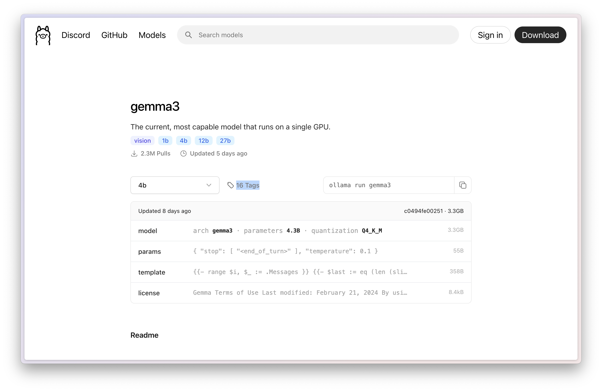
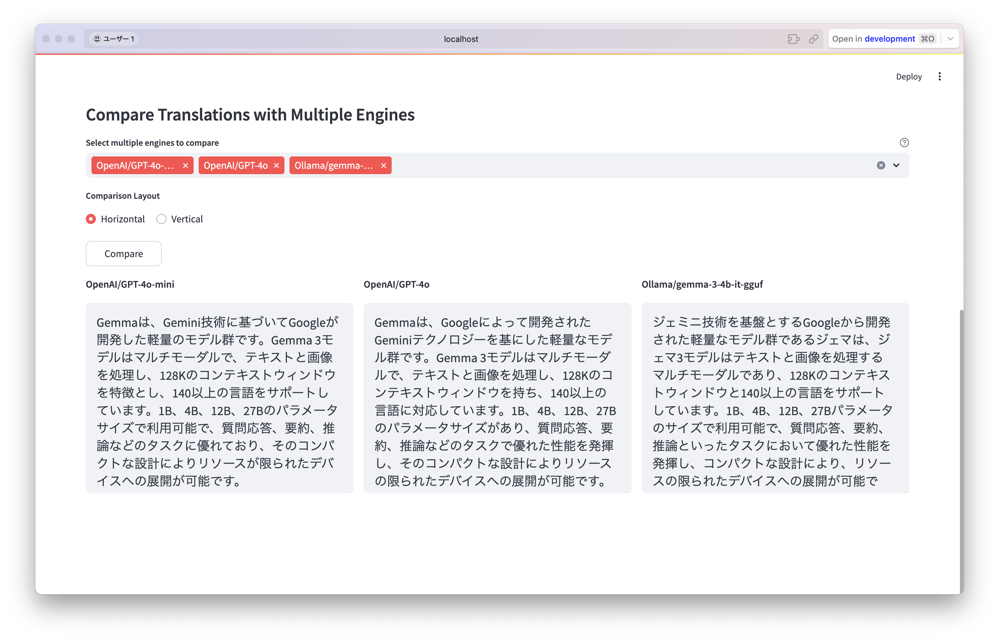

# Local Translator GUI

This repository provides a GUI application that allows you to select translation engines (such as OpenAI, Ollama, etc.) and perform text translation.  
In addition to the main translation functionality, it features the ability to **translate the same text with multiple engines and display the results for comparison**.  
The UI uses **Streamlit**, allowing you to operate it in your web browser.

---

## Main Features

1. **Model Management via YAML File**  
   Engine names selected by the user are mapped to the actual model IDs via `configs/avail_models.yaml`.  
   Example:  
   ```yaml
   OpenAI/GPT-4o-mini: gpt-4o-mini
   OpenAI/GPT-4o: gpt-4o
   Ollama/gemma-3-4b-it-gguf: gemma3:4b-it-q4_K_M
   ```
   This allows you to add or modify models without editing the code.

2. **Single Engine Translation & Multi-Engine Comparison**  
   - At the top of the interface, you can select a "Translation Engine" and a "Target Language", input text, and press "Run Translation" to display the result.  
   - At the bottom of the screen, you can select multiple engines and toggle between **Vertical** or **Horizontal** layout to compare translation results.

3. **Support for Multiple Engines**  
   - Selecting an `OpenAI` engine sends a request to the OpenAI API.  
   - Selecting an `Ollama` engine sends a request to the local Ollama server.

---

## Setup

1. **Clone or Download the Repository**  
   ```bash
   git clone git@github.com:Onely7/local_translator.git
   cd local_translator
   ```
2. **Install Required Libraries**  
   ```bash
   uv python install 3.12
   uv python pin 3.12
   uv sync --no-dev
   ```
3. **Check the Model Configuration File**  
   In `configs/avail_models.yaml`, define the model mappings you want to use.  
   Example:
   ```yaml
   OpenAI/GPT-4o-mini: gpt-4o-mini
   OpenAI/GPT-4o: gpt-4o
   Ollama/gemma-3-4b-it-gguf: gemma3:4b-it-q4_K_M
   ```
4. **OpenAI API Key (Optional)**  
   To use OpenAI, set your API key as an environment variable, like:  
   `export OPENAI_API_KEY="sk-xxxxxx"`

5. **Install Ollama (Optional)**  
   If you want to use Ollama, install it separately.  
   You have two options for installing Ollama:
   - Download the installer from the [Ollama official website](https://ollama.com/download)  
   - If you're using Homebrew, download it via Homebrew:  
     ```bash
     brew install ollama
     ```

6. **Install Local LLMs**  
   To use LLMs via Ollama, you need to download the models locally in advance.
   1. Find a model you want to use from the [Ollama model list](https://ollama.com/search)  
     
     
     
   In this example, we will download `gemma3:4b-it-q4_K_M`.

   2. **Download the Model**  
      ```bash
      ollama pull gemma3:4b-it-q4_K_M
      ```

---

## How to Run

```bash
uv run streamlit run translator.py
```

After execution, you should see the following message in your terminal:

```
You can now view your Streamlit app in your browser.

  Local URL:  http://localhost:8501
  Network URL: ...
```

A browser window will open displaying the translation app.  
If it doesn't appear, open the URL shown above in your browser manually to view the interface.

---

## How to Use

1. **Main Translation (Single Engine)**  
   - Select a **Translation Engine** from the dropdown at the top of the screen  
   - Select a **Target Language** from the dropdown on the right  
   - Enter the text you want to translate in the left column and click the "Run Translation" button below  
   - The translation result will appear in the right column.  
   

2. **Compare Engines (Multi-Engine Comparison)**  
   - In the **Select multiple engines to compare** section at the bottom, select multiple engines you want to compare  
   - Choose either **Horizontal** or **Vertical** under **Comparison Layout**  
   - Click the "Compare" button, and you’ll see the translation results from each engine for the same input text and target language displayed together.  
     

---

## Notes

- The **source language of the text** is automatically detected.  
  Simply specify the target language to perform translations such as Japanese → English or English → Japanese.  
  Adjust system prompts or pre-instructions as needed.
- **OpenAI API Costs**  
  Using OpenAI will incur usage fees.  
  Please check the [OpenAI pricing page](https://openai.com/pricing) before using it in production.
- **Ollama Model Sizes**  
  Models run locally with Ollama can be large in size.  
  Be mindful of download size and memory usage.
