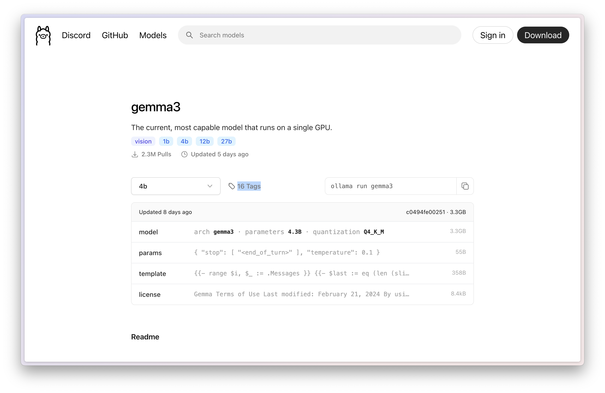
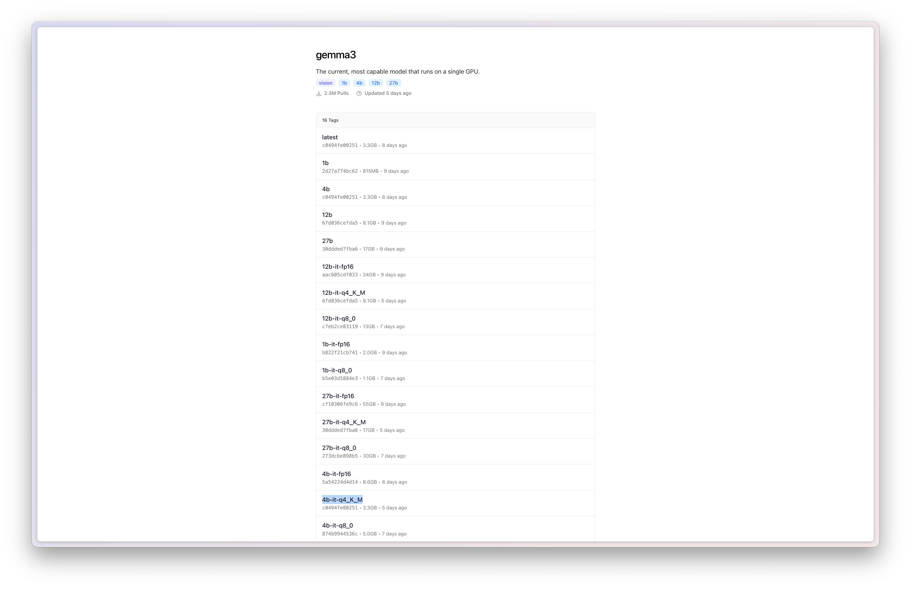
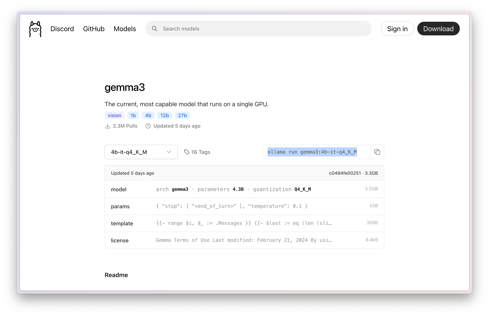
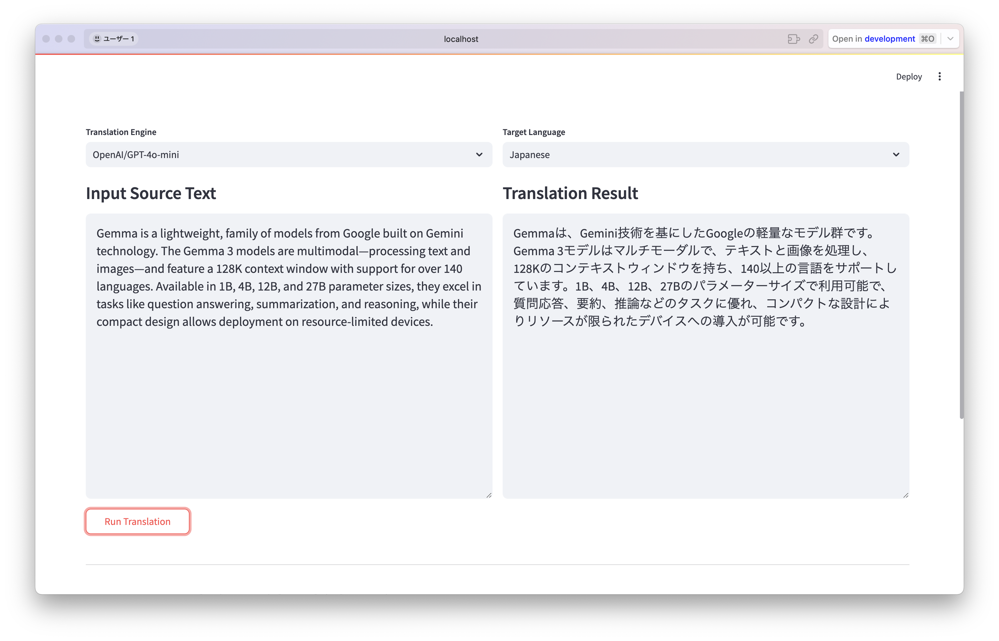
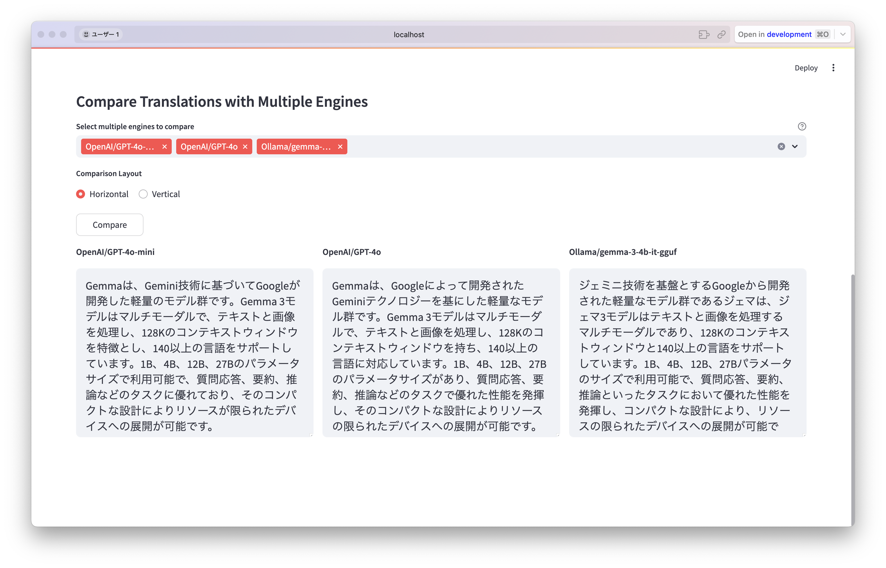

# Local Translator GUI

このリポジトリでは、翻訳エンジン (OpenAI, Ollama など) を選択して、テキスト翻訳を行うことのできる GUI アプリケーションを提供します。  
メインの翻訳機能に加えて、**複数のエンジンで同じテキストを翻訳し、結果を比較表示**する機能を備えています。  
UI には **Streamlit** を使用しており、ブラウザ上で操作することができます。

## 主な特徴

1. **YAML ファイルによるモデル管理**  
   `configs/avail_models.yaml` で、ユーザーが選択するエンジン名と実際に呼び出すモデル ID をマッピングしています。  
   例:  
   ```yaml
   OpenAI/GPT-4o-mini: gpt-4o-mini
   OpenAI/GPT-4o: gpt-4o
   Ollama/gemma-3-4b-it-gguf: gemma3:4b-it-q4_K_M
   ```
   これにより、コードを修正せずに新しいモデルを追加・変更できます。

2. **単一エンジンでの翻訳 & 複数エンジンでの比較**  
   - 画面上部では「翻訳エンジン」と「翻訳先の言語」を選択し、テキストを入力して「Run Translation」を押すと翻訳結果が表示されます。  
   - 画面下部では複数のエンジンを選択し、**縦並び (Vertical)** か **横並び (Horizontal)** のレイアウトを切り替えて翻訳結果を比較できます。

3. **複数のエンジンに対応**  
   - `OpenAI` 系のエンジンを選択すると、OpenAI API にリクエストを送信します。  
   - `Ollama` 系のエンジンを選択すると、ローカルの Ollama サーバにリクエストを送信します。

## 環境構築

1. **リポジトリをクローンまたはダウンロード**  
   ```bash
   git clone git@github.com:Onely7/local_translator.git
   cd local_translator
   ```
2. **必要なライブラリをインストール**  
   ```bash
   uv python install 3.12
   uv python pin 3.12
   uv sync --no-dev
   ```
3. **モデル設定ファイルを確認**  
   `configs/avail_models.yaml` に、使用したいモデルのマッピングを記述します。  
   例:
    ```yaml
    OpenAI/GPT-4o-mini: gpt-4o-mini
    OpenAI/GPT-4o: gpt-4o
    Ollama/gemma-3-4b-it-gguf: gemma3:4b-it-q4_K_M
    ```
4. **OpenAI API Key (任意)**  
   OpenAI を使用する場合は、`export OPENAI_API_KEY="sk-xxxxxx"` のように環境変数を設定してください。

5. **Ollama のインストール(任意)**  
   Ollama を使う場合は、別途 Ollama をインストールしておきます。  
   Ollama のインストール方法には、以下の２つの選択肢があります。
   - [Ollama の公式サイト](https://ollama.com/download) からインストーラーをダウンロード
   - [Homebrew](https://brew.sh/) を使用しているユーザーは、Homebrew 経由でダウンロード  
    ```bash
    brew install ollama
    ```

6. **ローカル LLM のインストール**  
    Ollama 経由で LLM を使用する場合、事前にローカル LLM をダンロードしておく必要がある。
    1. [Ollama の公式サイトのモデル一覧](https://ollama.com/search) から、使いたいモデルを探す  
      
      
    <br>
    今回は、`gemma3:4b-it-q4_K_M` をダウンロードすることにします。

    2. **モデルのダウンロード**  
      ```bash
      ollama pull gemma3:4b-it-q4_K_M
      ```

## 実行方法

```bash
uv run streamlit run translator.py
```

実行後、ターミナルに以下のようなメッセージが表示されます。

```
You can now view your Streamlit app in your browser.

  Local URL:  http://localhost:8501
  Network URL: ...
```

新規ウィンドウでブラウザが開かれ、翻訳アプリの画面が表示されます。
もし表示されなかった場合、上記 URL をブラウザで開くと、翻訳アプリの画面が表示されるはずです。

## 使い方

1. **メイン翻訳 (Single Engine)**  
   - 画面上部のプルダウンで **Translation Engine** を選択  
   - 右側のプルダウンで **Target Language** を選択  
   - 左カラムに翻訳したいテキストを入力し、下の **「Run Translation」** ボタンをクリック  
   - 右カラムに翻訳結果が表示されます。
   

2. **複数エンジン比較 (Compare Engines)**  
   - 画面下部の **Select multiple engines to compare** で、比較したいエンジンを複数選択  
   - **Comparison Layout** で **Horizontal** か **Vertical** を選択  
   - **「Compare」** ボタンをクリックすると、同じテキスト・同じターゲット言語に対する各エンジンの翻訳結果がまとめて表示されます。
     

## 注意点

- **翻訳元テキストの言語** は自動判定されます。  
  ターゲット言語だけ指定すれば、日本語 → 英語、英語 → 日本語などの翻訳を行います。  
  必要に応じてシステムプロンプトや事前の指示を調整してください。
- **OpenAI API の料金**  
  OpenAI を使用する場合、API 使用量に応じて料金が発生します。  
  実運用時には、[OpenAI の料金表](https://openai.com/pricing) をご確認ください。
- **Ollama のモデルサイズ**  
  ローカルで実行する Ollama モデルは大容量の場合があります。  
  モデルダウンロードやメモリ使用量にご注意ください。
